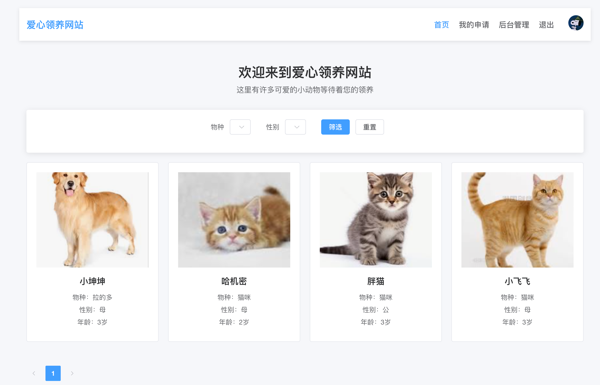

# 爱心领养网站 (Love Adoption)

<div align="center">
  
  
  
  
  
</div>

## 📝 项目介绍

爱心领养网站是一个基于Spring Boot和Vue.js开发的宠物领养平台，旨在为流浪动物提供一个温暖的家。该平台连接爱心人士与需要被领养的小动物，提供便捷的领养申请与管理功能，让更多的小动物能够找到属于自己的家。

## ✨ 功能特点

### 动物管理
- 动物信息发布：用户可以发布需要被领养的动物信息，包括名称、物种、年龄、性别、健康状况等
- 动物信息查询：支持多条件筛选查询，如按物种、年龄、性别等筛选
- 动物信息管理：支持对已发布的动物信息进行修改和删除

### 领养申请
- 领养申请提交：用户可以提交领养申请，说明领养理由
- 申请状态跟踪：用户可以查看自己的申请状态（待审核、通过、拒绝等）
- 申请审核：管理员可以审核领养申请，并提供审核意见

### 用户系统
- 用户注册登录：支持用户注册、登录功能
- 用户权限管理：区分普通用户和管理员权限
- 个人信息管理：用户可以管理自己的个人信息

### 其他功能
- 文件上传：支持图片上传功能，可用于上传动物照片
- 数据统计：提供平台数据统计功能，如领养成功率、动物分布等

## 🛠️ 技术栈

### 后端
- **框架**: Spring Boot 2.7.0
- **ORM**: MyBatis-Plus 3.5.1
- **数据库**: MySQL
- **缓存**: Redis
- **API文档**: Knife4j 3.0.3
- **对象存储**: 阿里云OSS
- **其他**: Lombok, Spring AOP, Spring Session

### 前端
- **框架**: Vue 3.5
- **UI组件库**: Element Plus 2.9
- **构建工具**: Vite 6.3
- **状态管理**: Pinia 3.0
- **路由**: Vue Router 4.5
- **HTTP客户端**: Axios

## 🚀 快速开始

### 环境要求
- JDK 1.8+
- npm 10.9.2+
- MySQL 5.7+
- Redis 5+

### 后端启动


#### 环境准备
1. 安装JDK 1.8+
2. 安装Maven 3.6+
3. 安装MySQL 5.7+
4. 安装Redis 6.0+

### 数据库配置
1. 创建名为`LoveAdoption`的数据库
2. 导入项目根目录下的`sql`文件夹中的SQL脚本

### 项目配置
1. 修改`src/main/resources/application.yml`中的数据库连接信息
   ```yaml
   spring:
     datasource:
       url: jdbc:mysql://localhost:3306/LoveAdoption
       username: your_username
       password: your_password
   ```

2. 配置Redis连接信息
   ```yaml
   spring:
     redis:
       host: localhost
       port: 6379
       database: 3
   ```

3. 配置阿里云OSS（如需使用文件上传功能）
   ```yaml
   la:
     alioss:
       access-key-id: your_access_key_id
       access-key-secret: your_access_key_secret
       endpoint: your_endpoint
       bucket-name: your_bucket_name
   ```

### 启动项目
1. 克隆项目到本地
   ```bash
   git clone https://github.com/yourusername/love-adoption.git
   ```

2. 进入项目目录
   ```bash
   cd love-adoption
   ```

3. 编译项目
   ```bash
   mvn clean package
   ```

4. 运行项目
   ```bash
   java -jar target/love-adoption-0.0.1-SNAPSHOT.jar
   ```

5. 访问API文档
   ```bash
   http://localhost:8080/api/doc.html
   ```

## 接口文档

项目集成了Knife4j，提供了详细的API文档，启动项目后可通过以下地址访问：
```
http://localhost:8080/api/doc.html
```

### 前端启动
1. 安装依赖
```bash
cd love-adoption-frontend
npm install
```

2. 启动开发服务器
```bash
npm run dev
```

3. 构建生产版本
```bash
npm run build
```

## 📷 项目截图



## 📚 项目结构

```
love-adoption/
├── backend/                 # 后端项目
│   ├── src/                 # 源代码
│   │   ├── main/
│   │   │   ├── java/       # Java代码
│   │   │   └── resources/  # 配置文件
│   ├── sql/                # 数据库脚本
│   └── pom.xml             # Maven配置
└── love-adoption-frontend/ # 前端项目
    ├── src/                # 源代码
    │   ├── api/            # API接口
    │   ├── assets/         # 静态资源
    │   ├── components/     # 组件
    │   ├── router/         # 路由
    │   ├── stores/         # Pinia状态管理
    │   └── views/          # 页面
    ├── public/             # 公共资源
    └── package.json        # NPM配置
```

